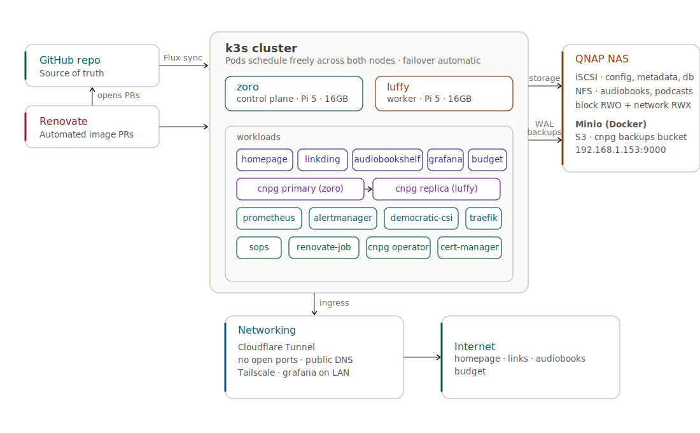

# 🏠 Homelab
Self-hosted infrastructure running on a 2-node Raspberry Pi k3s cluster, managed with Flux for GitOps continuous deployment.

---

## Philosophy

Everything is defined as code, version controlled, and applied declaratively. No manual `kubectl apply`, no SSH-ing into nodes to make changes. The Git repo is the single source of truth for what runs in the cluster — Flux handles the rest.

Storage is deliberately separated from compute. Persistent data lives on a QNAP NAS, not on the nodes. A CSI driver manages the attach/detach lifecycle automatically — if a node fails, the pod reschedules to the other node and storage follows. Single node failure is survivable.

Stateful workloads run on a dedicated HA PostgreSQL cluster. Backups are continuous, off-cluster, and independent of Kubernetes — if the cluster dies, the backup target stays alive.

---

## Architecture



---

## 🖥️ Hardware

| Node | Hardware | Role |
|------|----------|------|
| `zoro` | Raspberry Pi 5 (16GB) | Control plane |
| `luffy` | Raspberry Pi 5 (16GB) | Worker node |
| `nas` | QNAP TS-464 | Network attached storage — iSCSI LUNs, NFS shares, Minio S3 |

**Network:** Private overlay network via Tailscale — secure remote access without VPN configuration. External DNS managed via Cloudflare — services exposed via Cloudflare Tunnel (no open ports, no port forwarding).

---

## 🧰 Stack

| Tool | Purpose |
|------|---------|
| K3s | Lightweight Kubernetes distribution |
| Flux | GitOps controller — syncs cluster state with this repo |
| Kustomize | Environment-specific configuration and overlays |
| Helm | Package manager for Kubernetes applications |
| Traefik | Ingress controller |
| SOPS + Age | Secrets encryption — safe to commit encrypted secrets to Git |
| Renovate | Automated dependency updates — opens PRs for outdated images and charts |
| democratic-csi | CSI driver — manages iSCSI attach/detach between nodes automatically |
| CloudNative-PG | PostgreSQL operator — HA cluster, streaming replication, automated failover |
| Barman Cloud | PostgreSQL backup tool — WAL archiving and base backups to S3 |
| cert-manager | TLS certificate management for cluster-internal services |
| Minio | S3-compatible object storage on QNAP — backup target for CNPG |
| Prometheus | Metrics collection and alerting |
| Grafana | Metrics visualisation and dashboards |
| Cloudflare Tunnel | Secure public exposure of services without opening firewall ports |
| Tailscale | Private overlay network — secure remote access to the cluster |

---

## 📁 Repository Structure

```
Homelab/
├── renovate.json
├── README.md
└── pi-zoro/
    ├── apps/
    │   ├── base/          ← environment-agnostic manifests
    │   ├── staging/       ← staging overlays — disabled (commented out), kept for future use
    │   └── production/    ← production overlays — NAS storage, Cloudflare Tunnel
    ├── databases/         ← CNPG cluster, scheduled backups, SOPS-encrypted secrets
    ├── clusters/
    ├── docs/
    ├── infrastructure/    ← democratic-csi, cert-manager, CNPG operator, Renovate
    └── monitoring/        ← kube-prometheus-stack
```

Flux watches `clusters/staging/` and follows the chain of Kustomization files down to the actual resources. All secrets are encrypted with SOPS before being committed. Each app has its own README with a detailed breakdown of decisions, problems solved, and architecture.

Staging and production were separate overlays pointing at the same base — staging used local-path storage on the SD card, intentionally kept simple for contrast. Staging has since been disabled (running both prod and staging on a single Pi was overkill); the overlays are commented out and `prune: true` removed the staging namespaces from the cluster, but the framework is left in place to re-enable for experimental testing later. Production uses NAS-backed storage with no nodeSelector — pods run on either node and storage follows automatically.

---

## 🚀 Projects

### 🔖 [Linkding](./pi-zoro/docs/linkding/README.md)
Self-hosted bookmark manager. Accessible at `links.rahatahsan.com` via Cloudflare Tunnel.

Storage went through three stages — SD card → static iSCSI PV pinned to Zoro → democratic-csi managed iSCSI with no nodeSelector. Production data lives on a QNAP iSCSI LUN. Pod runs on either node, failover tested and proven. CPU/memory requests and limits sized from 30 days of Prometheus data. Migration to CNPG PostgreSQL backend planned.

### 📚 [Audiobookshelf](./pi-zoro/docs/audiobookshelf/README.md)
Self-hosted audiobook and podcast server. Accessible at `audiobooks.rahatahsan.com` via Cloudflare Tunnel.

Four volumes with a deliberate storage split — config and metadata on iSCSI LUNs (democratic-csi, block storage, RWO), audiobooks and podcasts on NFS shares (RWX, mounts on any node with no detach needed). Zero volumes on SD card in production. Full failover tested and proven. CPU/memory requests and limits sized from 30 days of Prometheus data — including a recurring ~1 core startup spike that informed the decision to leave CPU uncapped.

### 💰 [Actual Budget](./pi-zoro/docs/actual-budget/README.md)
Self-hosted personal finance app using envelope budgeting. Accessible at `budget.rahatahsan.com` via Cloudflare Tunnel.

Single iSCSI LUN for persistent SQLite data, no PostgreSQL dependency. Deployed non-root with PSA `restricted` from day one — discovered that fresh iSCSI LUNs format as `root:root`, requiring a one-time root initContainer to bootstrap volume permissions before the namespace was locked back to `restricted`. Full fix procedure documented for future LUN replacements.

### 🏠 [Homepage](./pi-zoro/docs/homepage/README.md)
Cluster startpage and app dashboard. Accessible at `homepage.rahatahsan.com` via Cloudflare Tunnel.

Single pod, no persistence — config lives entirely in Git via ConfigMap. Integrates with the Kubernetes API via a dedicated ClusterRole to display live cluster metrics, node CPU and memory, and pod counts. All apps in the cluster are linked from a single dashboard. PSA baseline enforced on the namespace, restricted audited. CPU limit raised from 200m to 500m after Prometheus showed thousands of CFS-throttled periods from bursty dashboard loads.

---

## 📊 Infrastructure & Data

**Storage:** QNAP TS-464 serves iSCSI LUNs (via democratic-csi), NFS shares, and Minio S3 (via Docker). iSCSI is used for databases and structured data. NFS is used for media. Minio is used as the S3 backup target for PostgreSQL. Storage is completely off the cluster nodes.

### 🐘 [CloudNative-PG](https://github.com/AhsanRahat12/Homelab/tree/main/pi-zoro/docs/cnpg)
Two-instance HA PostgreSQL cluster managed by the CloudNative-PG operator. Primary on zoro, replica on luffy, with streaming replication and automated failover. Built to replace per-app SQLite databases — SQLite on iSCSI is one dropped connection away from corruption.

Continuous WAL archiving to Minio via the Barman Cloud plugin. Daily base backups at 02:00 UTC with 30-day retention, preferring the standby to avoid load on the primary. The backup target lives on the QNAP outside Kubernetes — if the cluster dies, the backups survive.

HA failover was validated under a real iSCSI session drop during initial deployment — the primary lost storage, the replica was promoted within seconds, no data loss.

| Component | Storage | Size |
|-----------|---------|------|
| Primary (zoro) | iSCSI LUN on QNAP | 25Gi |
| Replica (luffy) | iSCSI LUN on QNAP | 25Gi |
| Backup target | Minio bucket on QNAP | unbounded, 30d retention |

### 📈 [kube-prometheus-stack](https://github.com/AhsanRahat12/Homelab/tree/main/pi-zoro/docs/Kube-Prometheus-Stack)
Full observability stack — Prometheus for metrics collection, Grafana for dashboards and visualisation, Alertmanager for alert routing. Accessible at `grs.rahatahsan.com` on the local network.

All three components were originally running on ephemeral emptyDir storage backed by SD cards — Prometheus TSDB is one of the worst workloads for SD card longevity, and every pod restart wiped all history. Migrated all three to dedicated iSCSI LUNs on QNAP via democratic-csi. Metrics and dashboards now survive restarts and redeployments. Write pressure is off the SD cards.

A full alerting suite was added on top — 11 PrometheusRule alerts covering storage staleness, PVC capacity, crash-looping pods, node pressure, and Flux reconciliation failures, routed through Alertmanager to a dedicated Slack channel via an encrypted webhook secret. End-to-end pipeline verified: a manual test alert reached Slack within 30 seconds.

| Component | Storage | Size |
|-----------|---------|------|
| Prometheus | iSCSI LUN on QNAP | 10Gi |
| Grafana | iSCSI LUN on QNAP | 2Gi |
| Alertmanager | iSCSI LUN on QNAP | 1Gi |

**Automated Updates:** Renovate runs as a Kubernetes CronJob, scanning the repo every hour and opening Pull Requests for outdated images or Helm chart versions.


---

## 🔥 Incidents & Lessons

- [iSCSI session drops triggered real CNPG failover](./pi-zoro/docs/cnpg/README.md#-key-engineering-decisions) — NIC power management bug, replica promoted automatically, zero data loss.
- [RollingUpdate + RWO corrupted a filesystem](./pi-zoro/docs/audiobookshelf/README.md#-key-engineering-decisions) — pod showed `1/1 Running` while dead inside; root-caused via `kubectl logs --previous` and missing liveness probes.
- [iSCSI volume deadlock on rolling restarts](./pi-zoro/docs/linkding/README.md#-key-engineering-decisions) — CrashLoopBackOff held the volume lock indefinitely; fixed with `strategy: Recreate`.
- [Three-stage storage migration with zero-downtime failover](./pi-zoro/docs/linkding/README.md#-key-engineering-decisions) — SD card → node-pinned PV → fully automated iSCSI.
- [Secret encrypted with the wrong SOPS Age key](./pi-zoro/docs/Kube-Prometheus-Stack/README.md#-key-engineering-decisions) — Flux decrypts with a different key than local SOPS; secret had to be deleted and re-encrypted with the cluster's key.
- [Alertmanager stuck in `Init:0/1` on an RWO volume multi-attach](./pi-zoro/docs/Kube-Prometheus-Stack/README.md#-key-engineering-decisions) — scaling and force-deleting the pod didn't help; fixed by deleting the stuck `VolumeAttachment` object directly.
- [A resource patch silently surfaced a year-old PodSecurity gap](./pi-zoro/docs/linkding/README.md#-key-engineering-decisions) — bumping cloudflared's pod template hash triggered a rollout that the `restricted` namespace rejected; the old pod had been grandfathered in since before PSA enforcement.
- [Fresh iSCSI LUN formatted root:root blocked non-root writes](./pi-zoro/docs/actual-budget/README.md#-key-engineering-decisions) — Kubernetes `fsGroup` changes group ownership but not user ownership; a non-root container couldn't mkdir on the volume root. Temporarily relaxed namespace PSA to `baseline` for a one-time root initContainer chown, then restored to `restricted`.
- [A stuck CNPG primary went undetected for 2 days despite HA](./pi-zoro/docs/cnpg/README.md#-key-engineering-decisions) — the liveness probe only checked that the process was alive, not that it could actually read or write data, so it kept passing while the pod silently failed every query. Fixed with a Prometheus alert on extended pod-not-ready state; a follow-up manual failover test confirmed CNPG's own failover completes in under a minute once it gets a clear signal.
- [A new pod-readiness alert paged every ~15 minutes on completed CronJob pods](./pi-zoro/docs/Kube-Prometheus-Stack/README.md#-alerting) — `PodNotReadyExtended` didn't exclude pods that finish on purpose; the hourly `renovate` CronJob left completed pods stuck permanently `Ready=false`, each tripping the alert 15 minutes after it finished. Fixed by gating the expression on pod phase `Running`.

---

## 🌐 Connect

[LinkedIn](https://www.linkedin.com/in/rahatahsan/) &nbsp;•&nbsp; [Twitter/X](https://x.com/RahatAhsan20) &nbsp;•&nbsp; [GitHub (Main Profile)](https://github.com/AhsanRahat12) &nbsp;•&nbsp; [Medium](https://medium.com/@s.rahatahsan)
