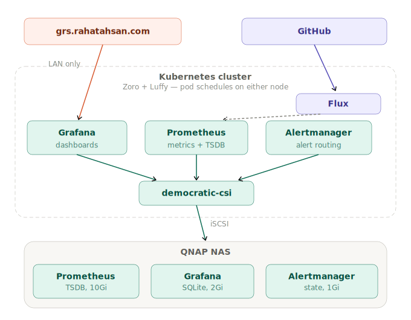

# 📊 kube-prometheus-stack
Self-hosted observability stack deployed on Kubernetes via GitOps. Provides cluster-wide metrics, dashboards, and alerting — backed by durable iSCSI storage on QNAP. [prometheus-community/kube-prometheus-stack](https://github.com/prometheus-community/helm-charts/tree/main/charts/kube-prometheus-stack)

Migrated all three components off SD cards after 28 combined pod restarts wiped all metrics, dashboards, and alert state.

**Grafana at** [grs.rahatahsan.com](https://grs.rahatahsan.com) — LAN only, not publicly accessible

> **TL;DR:** Migrated Prometheus, Grafana, and Alertmanager off SD-card storage after 28 combined restarts wiped all metrics and dashboards — moved to dedicated iSCSI LUNs, fixed root-owned volume permissions, and resolved Operator-vs-manual PVC ownership conflicts.

---

## Architecture

<p align="center">
  
</p>

---

## Stack

| Concern | Solution |
|---------|----------|
| Deployment | Flux GitOps — HelmRelease, no manual `kubectl apply` |
| Storage | democratic-csi → iSCSI LUNs on QNAP NAS — Prometheus 10Gi, Grafana 2Gi, Alertmanager 1Gi |
| CSI Driver | democratic-csi node-manual — handles iSCSI attach/detach between nodes automatically |
| Metrics retention | 30 days — explicit in HelmRelease values, prevents unbounded TSDB growth |
| Dashboards | Auto-provisioned by chart sidecar — survive restarts and redeployments |
| External access | Grafana exposed via Traefik ingress + TLS at grs.rahatahsan.com — local network only |
| Image updates | Renovate CronJob — automated PRs on new releases |
| Alertmanager replicas | 1 — single replica, correct for a 2-node cluster |

---

## 📁 Repo Structure

```
monitoring/
  controllers/
    base/kube-prometheus-stack/      ← HelmRelease, HelmRepository, namespace
    staging/kube-prometheus-stack/   ← kustomization overlay wiring
  configs/
    staging/kube-prometheus-stack/   ← PVs, Grafana PVC, TLS secret, kustomization
docs/
  monitoring/README.md               ← you are here
```

The HelmRelease in `controllers/base` defines the full chart configuration including all storage values. The PVs and Grafana PVC live in `configs/staging` — they are static resources that must exist and be `Bound` before the HelmRelease reconciles.

---

## 🧠 Problems & Decisions

**All three components were writing to SD cards with zero persistence.**

The default Helm deployment uses emptyDir volumes — ephemeral storage backed by whatever the node has locally. On this cluster that means SD cards. Prometheus TSDB is one of the worst possible workloads for SD card longevity — constant writes, constant compaction, never idle. By the time the migration happened, both SD cards were at 67–69% capacity and growing. The damage was already visible:

| Component | Restarts before migration | Impact |
|---|---|---|
| Prometheus | 8 | 8 complete wipes of all metrics history |
| Grafana | 12 | 12 complete wipes of dashboards and datasource config |
| Alertmanager | 8 | 8 wipes of silence rules and state |

Every Grafana restart meant manually reconfiguring the Prometheus datasource from scratch. Every Prometheus restart meant starting from zero — no history, no trends, no baselines. Fixed by migrating all three components to dedicated iSCSI LUNs on QNAP.

**Operator-managed components own their own PVCs.**

Grafana is a plain Deployment — Helm owns it directly. A PVC is created manually and handed to Helm via `existingClaim`.

Prometheus and Alertmanager are StatefulSets managed by the Prometheus Operator. The Operator creates its own PVCs automatically from `volumeClaimTemplate` in the values. Manually creating PVCs for these components causes a collision — the Operator's auto-generated PVCs get stuck `Pending` because the PVs are already bound to the manual ones. The fix: create PVs only, let the Operator create the PVCs itself.

```
Grafana     → you create PV + PVC → hand PVC to Helm via existingClaim
Prometheus  → you create PV only  → Operator creates PVC automatically
Alertmanager→ you create PV only  → Operator creates PVC automatically
```

**Fresh iSCSI LUNs are root-owned — Prometheus cannot write to them.**

Block LUNs are formatted with root ownership at the filesystem level. Prometheus runs as a non-root user (UID 1000) and gets `permission denied` on every write. Two things are required to fix this permanently:

`fsGroup: 2000` in the pod securityContext tells Kubernetes to chown the mount point at attach time. An initContainer runs once as root before Prometheus starts and fixes ownership on the already-formatted volume. Both are needed because `fsGroup` alone does not retroactively fix an already-formatted filesystem.

```yaml
securityContext:
  runAsNonRoot: true
  runAsUser: 1000
  runAsGroup: 2000
  fsGroup: 2000
initContainers:
  - name: fix-permissions
    image: busybox
    command: ["sh", "-c", "chown -R 1000:2000 /prometheus"]
    securityContext:
      runAsUser: 0
      runAsNonRoot: false   # required — overrides pod-level non-root policy
```

**Retain policy requires manual claimRef cleanup.**

When a PVC bound to a `ReclaimPolicy: Retain` PV is deleted, the PV enters `Released` state. Kubernetes will not rebind it automatically — even if a new PVC with the right spec is created. The claimRef must be cleared manually before the PV becomes `Available` again:

```bash
kubectl patch pv <name> -p '{"spec":{"claimRef":null}}'
```

**Grafana SQLite database corrupted during PVC transition.**

During the migration the Grafana database was written to the new PVC in a partially corrupted state. Grafana served a white page and all operations returned `database disk image is malformed`. The fix was to scale down Grafana, delete the corrupted PVC, clear the PV claimRef, let Flux recreate the PVC fresh, then scale back up. Grafana booted with a clean database and the chart sidecar automatically reloaded all default dashboards. No data was lost — 12 prior restarts had already wiped everything.

**Prometheus retention must be set explicitly.**

Without a retention value, TSDB grows until the LUN is full. Set to 30 days in HelmRelease values. On a small cluster with default scrape targets, real usage is 1–3Gi — 10Gi provides 3–5x headroom.

**Alertmanager must be single replica on a 2-node cluster.**

A second Alertmanager replica has no scheduling guarantee on a 2-node cluster and will sit `Pending` indefinitely. `replicas: 1` is set explicitly in HelmRelease values to prevent this.

---

## Storage Sizing

| Component | Size | Rationale |
|---|---|---|
| Prometheus | 10Gi | 30d retention on a small cluster. Real usage ~1–3Gi. 10Gi gives 3–5x headroom for target growth. Do not go below 5Gi — compaction needs working space. |
| Grafana | 2Gi | SQLite DB + dashboards + plugins. Real usage under 200Mi. 2Gi is effectively infinite. |
| Alertmanager | 1Gi | Silence rules and state only. Real usage under 50Mi. 1Gi is the minimum sensible LUN size. |

---

## 🚀 What's Next

| Item | Status |
|------|--------|
| Resource limits | Planned — measure with Prometheus before setting |
| Readiness and liveness probes | Planned |
| Alerting rules | No alerts configured yet. Needs rules for node pressure, pod crash loops, and PVC capacity thresholds. |
| Grafana PostgreSQL migration | Replace SQLite with PostgreSQL to eliminate corruption risk on storage interruptions. SQLite on iSCSI is fragile — one dropped connection can corrupt the database. |

---

## 🔗 Related

- [Homelab Overview](https://github.com/AhsanRahat12/Homelab)
- [GitHub Profile](https://github.com/AhsanRahat12)
