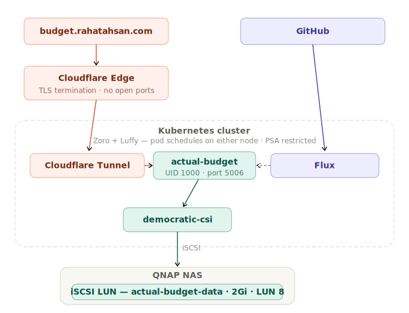

# 💰 Actual Budget
Self-hosted personal finance app using envelope budgeting, deployed on Kubernetes via GitOps. [actualbudget/actual](https://github.com/actualbudget/actual)

Single iSCSI LUN, single pod, SQLite on block storage. No PostgreSQL dependency — all budget data lives in one volume.

**Live at** [budget.rahatahsan.com](https://budget.rahatahsan.com)

> **TL;DR:** Deployed a SQLite-based personal finance app with PSA `restricted` enforced from day one. Discovered that fresh iSCSI LUNs format as `root:root` — Kubernetes `fsGroup` only changes group ownership, not user ownership, so a non-root container can't write to the volume root. Temporarily relaxed the namespace to PSA `baseline` to run a one-time root initContainer that chowned `/data` to UID 1000, then locked the namespace back to `restricted`. The fix is permanent on the LUN and documented for future reference.

      

---

## Architecture

<p align="center">
  
</p>

---

## Stack

| Concern | Solution |
|---------|----------|
| Storage | Single iSCSI LUN on QNAP (2Gi, LUN 8, RWO) — all budget data in one SQLite database |
| External access | Cloudflare Tunnel → [budget.rahatahsan.com](https://budget.rahatahsan.com) — no open ports |
| Security | PSA `restricted` enforced — non-root UID 1000, capabilities dropped, seccomp |
| Deploy strategy | `Recreate` — RWO iSCSI volume requires single-pod exclusive access |
| Auth | Password set on first login via browser UI — stored in SQLite, no env var needed |

---

## 📁 Repo Structure

```
apps/
  base/actual-budget/           ← deployment, service, PVC (shared)
  production/actual-budget/     ← iSCSI PV, PVC patch, Cloudflare tunnel, SOPS secrets
clusters/
  staging/                      ← Flux entry point, SOPS config
infrastructure/
  controllers/
    base/democratic-csi/        ← HelmRelease, StorageClass, CHAP secret (shared)
docs/
  actual-budget/README.md       ← you are here
  actual-budget/architecture.svg
```

Base defines what Actual Budget needs to run — deployment, service, PVC with no storage class. The production overlay binds to the specific iSCSI LUN on QNAP, adds the Cloudflare Tunnel, and patches resource limits. All secrets are SOPS-encrypted before being committed.

---

## 🔒 Security

### Pod Security Admission — namespace enforced

The `actual-budget-prod` namespace enforces the `restricted` Pod Security Standard.

```yaml
labels:
  pod-security.kubernetes.io/enforce: restricted
  pod-security.kubernetes.io/warn: restricted
  pod-security.kubernetes.io/warn-version: latest
```

### Pod Security Context

```yaml
spec:
  securityContext:
    runAsNonRoot: true
    runAsUser: 1000
    runAsGroup: 1000
    fsGroup: 1000
    seccompProfile:
      type: RuntimeDefault
  containers:
  - securityContext:
      allowPrivilegeEscalation: false
      readOnlyRootFilesystem: false
      capabilities:
        drop:
        - ALL
```

| Setting | What It Does |
|---------|-------------|
| `runAsNonRoot: true` | Kubernetes rejects the pod if the process would run as root |
| `runAsUser: 1000` | Process runs as the `node` user — matches the image's built-in user |
| `fsGroup: 1000` | Mounted volume group ownership is changed to 1000 |
| `capabilities.drop: ALL` | All Linux kernel capabilities stripped |
| `seccompProfile: RuntimeDefault` | Blocks dangerous kernel syscalls |
| `allowPrivilegeEscalation: false` | Process cannot gain privileges mid-run |
| `readOnlyRootFilesystem: false` | App writes session state to the container filesystem at runtime |

---

## 🧠 Key Engineering Decisions

**Fresh iSCSI LUN formats as root:root — non-root container can't write.** When a new iSCSI LUN is attached for the first time, the OS formats an ext4 filesystem with the root directory owned by `root:root` (mode 755). Kubernetes `fsGroup` only changes the **group** ownership to the specified GID — it does not change the **user** ownership. With user ownership still `root (0)` and group permissions `r-x` (no write), a container running as UID 1000 gets `EACCES` when trying to `mkdir /data/server-files`. The same mechanism worked for linkding and audiobookshelf because those apps originally ran as root when first deployed — root wrote to the volume and created all directories before those deployments were later hardened to non-root.

**Fix: one-time root initContainer, PSA temporarily relaxed.** PSA `restricted` blocks any container from running as root, which prevents the obvious fix of a root initContainer. The namespace was temporarily changed to PSA `baseline`, a root initContainer ran `chown 1000:1000 /data` with `CAP_CHOWN` added back, and then the namespace was restored to `restricted`. The chown is permanent on the LUN's filesystem — subsequent pod restarts do not need root again. The full procedure is documented below for future LUN replacements.

**UID 1001 → UID 1000.** Initial deployment used `runAsUser: 1001`, which added an extra failure on top of the root:root issue. The `actualbudget/actual-server` image runs its Node.js process as the built-in `node` user (UID 1000, GID 1000). Overriding to 1001 caused an immediate `EACCES` crash on startup even before the volume permission problem was understood. Corrected to 1000 to match the image's intended user.

**No PostgreSQL dependency.** Actual Budget uses SQLite stored in a single file on disk. This keeps the deployment simple — one pod, one volume, no CNPG dependency. The trade-off is that SQLite on iSCSI is vulnerable to corruption on unclean detach (same risk as linkding), but for a personal budget app this is acceptable. If the cluster ever grows or multi-user access is needed, CNPG migration is straightforward.

<details>
<summary><strong>Volume permission fix procedure (for future LUN replacements)</strong></summary>

If the iSCSI LUN is ever replaced with a fresh one, `/data` will revert to `root:root` ownership and the app will fail on startup. To fix:

**Step 1** — Temporarily change `apps/production/actual-budget/namespace.yaml`:
```yaml
pod-security.kubernetes.io/enforce: baseline
pod-security.kubernetes.io/warn: baseline
```

**Step 2** — Add the following initContainer to `apps/base/actual-budget/deployment.yaml` (before `containers:`):
```yaml
initContainers:
  - name: fix-data-permissions
    image: busybox:1.37.0
    command: ["sh", "-c", "chown 1000:1000 /data"]
    securityContext:
      runAsUser: 0
      runAsNonRoot: false
      allowPrivilegeEscalation: false
      capabilities:
        drop:
          - ALL
        add:
          - CHOWN
    volumeMounts:
      - mountPath: /data
        name: actual-budget-data
```

**Step 3** — Push both changes. Wait for Flux to reconcile and the pod to reach `1/1 Running`.

**Step 4** — Remove the initContainer and restore `namespace.yaml` to `restricted`. Push again. Done.

Note: `chown -R` (recursive) will fail on `/data/lost+found` — use `chown 1000:1000 /data` (directory only) instead.

</details>

---

## 🔗 Related

- [Homelab Overview](https://github.com/AhsanRahat12/Homelab)
- [GitHub Profile](https://github.com/AhsanRahat12)
