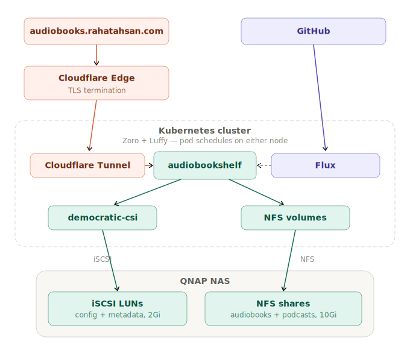

# 📚 Audiobookshelf
Self-hosted audiobook and podcast manager deployed on Kubernetes via GitOps. [advplyr/audiobookshelf](https://github.com/advplyr/audiobookshelf)

Four volumes, two storage backends (iSCSI + NFS), tested node failover, zero data on SD card in production.

**Live at** [audiobooks.rahatahsan.com](https://audiobooks.rahatahsan.com)

> **TL;DR:** Designed a split storage architecture (iSCSI for databases, NFS for media) across two nodes with tested failover. Diagnosed and recovered from a real filesystem corruption incident caused by a RollingUpdate/RWO deadlock — including root-causing a "1/1 Running but dead inside" pod with no liveness probe.

---

## Architecture

<p align="center">
  
</p>

---

## Stack

| Concern | Solution |
|---------|----------|
| Deployment | Flux GitOps — no manual `kubectl apply` |
| Secrets | SOPS + Age encryption, safe to store in public Git |
| Storage — config + metadata | democratic-csi → iSCSI LUNs on QNAP NAS — 2Gi each, data off the Pi |
| Storage — audiobooks + podcasts | NFS shares on QNAP NAS — 10Gi each, ReadWriteMany |
| CSI Driver | democratic-csi node-manual — handles iSCSI attach/detach between nodes automatically |
| External access | Cloudflare Tunnel → [audiobooks.rahatahsan.com](https://audiobooks.rahatahsan.com) — no open ports or port forwarding (production only) |
| Image updates | Renovate CronJob — automated PRs on new releases |
| Security | PSA restricted enforced, non-root (UID 1000), capabilities dropped, seccomp RuntimeDefault, read-only filesystem |
| Deploy strategy | `Recreate` — RWO iSCSI volumes require single-pod exclusive access, RollingUpdate causes deadlock |
| Health checks | Readiness + liveness probes on `/healthcheck` port 3005 |

---

## 📁 Repo Structure

```
apps/
  base/audiobookshelf/          ← deployment, service, PVCs, configmap (shared)
  staging/audiobookshelf/       ← local-path, internal only, no Cloudflare
  production/audiobookshelf/    ← iSCSI PVs, NFS PVs, PVC patches, Cloudflare tunnel
clusters/
  staging/                      ← Flux entry point, SOPS config
infrastructure/
  controllers/
    base/democratic-csi/        ← HelmRelease, StorageClass, CHAP secret (shared with linkding)
docs/
  audiobookshelf/README.md      ← you are here
```

Base defines what Audiobookshelf needs to run. The staging layer stamps the namespace with local-path storage — no Cloudflare, no NAS. The production layer points at the same base and overrides all four volumes via patches. The delta lives entirely in the environment overlay, base is untouched.

---

## 🔒 Security

Security is implemented in layers. Each layer assumes the previous one failed.

### Pod Security Admission — namespace enforced

The `audiobookshelf-prod` namespace enforces the `restricted` Pod Security Standard. Any pod that does not meet the standard is rejected at admission time before it ever runs.

```yaml
labels:
  pod-security.kubernetes.io/enforce: restricted
  pod-security.kubernetes.io/warn: restricted
  pod-security.kubernetes.io/warn-version: latest
```

`warn` is kept alongside `enforce` so future violations surface immediately as warnings.

### Pod Security Context

The initial foundation was `runAsUser: 1000`, `runAsGroup: 1000`, `fsGroup: 1000`, and `allowPrivilegeEscalation: false`. Implementing PSA restricted surfaced three additional gaps which were added deliberately.

```yaml
spec:
  securityContext:
    runAsNonRoot: true
    runAsUser: 1000
    runAsGroup: 1000
    fsGroup: 1000
    seccompProfile:
      type: RuntimeDefault
  containers:
  - securityContext:
      allowPrivilegeEscalation: false
      readOnlyRootFilesystem: true
      capabilities:
        drop:
        - ALL
```

| Setting | What It Does |
|---------|-------------|
| `runAsNonRoot: true` | Kubernetes rejects the pod if the process would run as root |
| `runAsUser: 1000` | Process runs as the `node` user, not root |
| `capabilities.drop: ALL` | All Linux kernel capabilities stripped — no raw sockets, no module loading, no ptrace |
| `seccompProfile: RuntimeDefault` | Blocks dangerous kernel syscalls used in container breakout attacks |
| `allowPrivilegeEscalation: false` | Process cannot gain more privileges mid-run — sudo and setuid binaries are blocked |
| `readOnlyRootFilesystem: true` | Container cannot write to its own filesystem — no persistence for an attacker |

All writes go to dedicated mounted volumes (PVCs), not the container filesystem.

---

## 🧠 Problems & Decisions

**Container ran as root.** Confirmed via `cat /etc/passwd` inside the container. Identified `node` (UID 1000, GID 1000) as the intended user. Applied `runAsUser`, `runAsGroup`, and `fsGroup` at the pod level and `allowPrivilegeEscalation: false` at the container level. `fsGroup` is specifically required to make mounted volumes writable — without it the app gets permission denied errors despite running as the correct user.

**Secrets weren't safe to commit.** Kubernetes secrets are base64-encoded, not encrypted — effectively plain text in Git. Chose SOPS + Age because Flux has native integration requiring no extra tooling. Flux holds the private key inside the cluster and decrypts at deploy time. The key never touches the repo.

**Why iSCSI for config and metadata, NFS for audiobooks and podcasts.**

Config holds the SQLite database and app settings. Metadata holds book covers and cached thumbnails. Both are write-heavy, structured, and need exclusive block device access — iSCSI is the right storage type. NFS would introduce consistency risks for a live database.

Audiobooks and podcasts are large media files — read-heavy, append-only, no concurrent write risk. NFS is the right storage type here. It is ReadWriteMany, meaning both nodes can mount the share simultaneously with no attach/detach needed during failover.

```
/config     → iSCSI LUN 1 (2Gi)  — block storage, RWO, exclusive access
/metadata   → iSCSI LUN 2 (2Gi)  — block storage, RWO, exclusive access
/audiobooks → NFS share (10Gi)   — network share, RWX, mounts on any node
/podcasts   → NFS share (10Gi)   — network share, RWX, mounts on any node
```

**Storage architecture evolution.**

```
Stage 1 — local-path (SD card)
  All four volumes on the Pi's SD card
  Unreliable for databases, no failover possible

Stage 2 — Production environment with democratic-csi + NFS
  Config and metadata → iSCSI LUNs on QNAP, managed by democratic-csi
  Audiobooks and podcasts → NFS shares on QNAP
  No nodeSelector — pod runs on either Zoro or Luffy
  Single node failure is now survivable
```

**fstab cleanup before democratic-csi.** Both iSCSI LUNs were previously mounted on Zoro via fstab from manual setup. fstab and democratic-csi cannot both manage the same block device — fstab entries were removed from Zoro before Flux applied the PVs. This was the only manual step in the migration.

**QNAP NFS fsid cache bug.** During NFS share setup, renaming a share does not generate a new fsid — QNAP caches the original. This caused inconsistent mount behaviour between nodes. Fix: delete the share completely, restart the NFS service on QNAP, recreate fresh. Both nodes then mounted consistently.

**PVC accessMode immutability.** Changing base PVCs from `ReadWriteOnce` to `ReadWriteMany` caused Flux to fail — Kubernetes does not allow mutating accessModes on a bound PVC. Fix: scale deployment to 0, remove finalizers, force delete PVCs, force Flux reconcile. PVCs were recreated fresh with the correct spec.

**Cloudflare tunnel moved from staging to production.** Staging had the only Cloudflare tunnel. It was moved to production as part of this migration — staging is now internal only. Production is the only environment with external access.

**Implementing Pod Security Admission.** Started with `warn` mode to identify violations without breaking the running pod. The warnings revealed three gaps: `capabilities.drop: ALL` was missing, `runAsNonRoot: true` was not set despite `runAsUser: 1000` being present, and no `seccompProfile` was defined. Each of these was added deliberately — capability drops remove kernel-level attack surface, `runAsNonRoot` enforces the non-root requirement at the Kubernetes level rather than relying on the image, and `seccompProfile: RuntimeDefault` blocks the syscalls most commonly used in container breakout attacks. Once the pod ran clean with zero warnings, the namespace label was updated from `warn` to `enforce`. Any pod that does not meet the restricted standard is now rejected before it runs.

**RollingUpdate + RWO caused deadlock and filesystem corruption — June 2026.** No explicit strategy meant Kubernetes defaulted to RollingUpdate. Renovate bumped the image, the new pod sat in `ContainerCreating` for 24 hours because the RWO iSCSI volumes were held by the old pod. `kubectl rollout restart` forced both pods to die simultaneously — the unclean detach corrupted the ext4 journal on the metadata LUN. Every write threw `EIO`. The pod showed `1/1 Running` with zero restarts while completely dead inside — no liveness probe to catch it. Recovery came when Flux reconciled and democratic-csi provisioned a fresh device attachment. Fix: `strategy: Recreate` added explicitly. The corrupted metadata LUN still needs `fsck` at the next maintenance window.

**Readiness and liveness probes added — June 2026.** ABS exposes `/healthcheck` on port 3005. Startup confirmed at 613ms from timestamped logs — no startupProbe needed. Readiness at 5s, liveness at 30s — readiness always fires first (golden rule). Liveness period kept generous at 20s to avoid false positives during library scans.

---

## 🔄 Failover

Pod successfully rescheduled from Luffy to Zoro with all four volumes following.

- iSCSI volumes (config, metadata) — democratic-csi detached from Luffy, reattached to Zoro automatically
- NFS volumes (audiobooks, podcasts) — ReadWriteMany, no detach needed, mounted on Zoro immediately

```
Before: audiobookshelf running on Luffy
Cordon Luffy → delete pod → reschedule
After:  audiobookshelf running on Zoro — all data intact, app accessible
```

Staging intentionally kept on local-path — no failover, no NAS. The contrast between staging and production demonstrates the architectural difference clearly.

---

## 🚀 What's Next

| Item | Status |
|------|--------|
| Resource limits | Planned — measure with Prometheus before setting |

---

## 🔗 Related

- [Homelab Overview](https://github.com/AhsanRahat12/Homelab)
- [GitHub Profile](https://github.com/AhsanRahat12)
