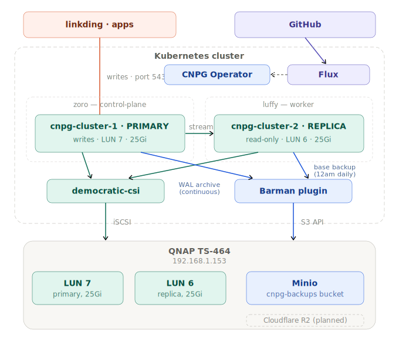

# 🐘 CloudNative-PG
Two-instance HA PostgreSQL cluster deployed on Kubernetes via GitOps. Provides a shared database backend for all homelab applications — backed by durable iSCSI storage on QNAP with automated daily backups to Minio via Barman. [cloudnative-pg/cloudnative-pg](https://github.com/cloudnative-pg/cloudnative-pg)

Built to replace per-app SQLite databases that were one iSCSI hiccup away from corruption.

> **TL;DR:** Built and operated a 2-node HA PostgreSQL cluster on Kubernetes — streaming replication, automated daily backups to S3-compatible storage, and a real failover that was triggered by an actual production incident (not a drill) and recovered with zero data loss.

     

---

## Architecture

<p align="center">
  
</p>

---

## Stack

| Concern | Solution |
|---------|----------|
| Deployment | Flux GitOps — HelmRelease for operator, raw manifests for Cluster resource |
| Data storage | democratic-csi → iSCSI LUNs on QNAP NAS — 25Gi primary, 25Gi replica, `Retain` policy |
| Backups | Barman Cloud → Minio S3 on QNAP, daily 02:00 UTC, 30-day retention |
| HA topology | topologySpreadConstraints — one primary + one replica, one per node, automatic failover |
| Secrets | SOPS + Age encryption — superuser and Barman S3 credentials |

---

## 📁 Repo Structure

```
infrastructure/controllers/
  base/cert-manager/                 ← HelmRelease, HelmRepository
  base/cnpg/                         ← CNPG operator HelmRelease, HelmRepository
  base/cnpg-barman-plugin/           ← Barman plugin HelmRelease, HelmRepository
  staging/cert-manager/              ← namespace, kustomization overlay
  staging/cnpg/                      ← namespace, kustomization overlay
  staging/cnpg-barman-plugin/        ← kustomization overlay

databases/
  base/cnpg-cluster/                 ← Cluster resource, ScheduledBackup
  staging/cnpg-cluster/              ← namespace, PVs, SOPS secrets, kustomization
  production/cnpg-cluster/           ← empty, for future promotion

clusters/staging/
  databases.yaml                     ← Flux Kustomization entrypoint

docs/cnpg/
  README.md                          ← you are here
  architecture.svg                   ← architecture diagram
  cnpg-chown-job.yaml                ← bootstrap: volume ownership fix
  pvc-chown-bootstrap.yaml           ← bootstrap: temporary PVC for chown
  cnpg-test-backup.yaml              ← on-demand backup trigger
```

The CNPG operator is installed at the infrastructure layer via HelmRelease. The Cluster resource and its supporting manifests live in a separate `databases/` layer with an explicit Flux dependency on `infrastructure-controllers`.

---

## 🧠 Key Engineering Decisions

**iSCSI sessions dropped intermittently in production — and HA failover proved itself for real.** PostgreSQL began hitting `Input/output error` on random file operations; the CNPG operator detected the storage failure and promoted the replica automatically within seconds. Root cause: both Pi nodes had NIC power management set to `auto` — the kernel briefly slept the interface during idle periods, severing the iSCSI session, and PostgreSQL — which needs constant disk I/O — panicked immediately. Fixed by setting `power/control` to `on` on both nodes via a systemd service. The architecture proved itself under a real, unplanned failure with zero data loss.

**Fresh iSCSI LUNs are root-owned — and CNPG can't use an initContainer to fix it.** `mkfs.ext4` creates a root-owned filesystem; PostgreSQL runs as UID 26 and `initdb` fails with `Permission denied`. Unlike kube-prometheus-stack, the CNPG Cluster CRD doesn't support `spec.initContainers` — adding one fails Flux's dry-run validation. The fix is a one-time bootstrap Job that mounts each PVC as root and runs `chown -R 26:26 /data`; because the PVs use `Retain` policy, the ownership persists across all future restarts and redeployments.

```
Prometheus  → initContainer in HelmRelease values    → self-healing on every deploy
CNPG        → one-time bootstrap Job                 → persists via Retain policy
```

**PVs with Retain policy get stuck `Released` — undocumented `claimRef` pre-binding fix.** When a PVC is deleted, its `Retain` PV enters `Released` state and Kubernetes refuses to rebind it, even to a new PVC with the exact same name and spec — the new cluster hangs forever waiting for storage. The fix, discovered through repeated cluster deletions during debugging and not documented in any CNPG guide, is pre-binding each PV to its expected PVC name via `claimRef`:

```yaml
spec:
  claimRef:
    name: cnpg-cluster-1
    namespace: cnpg
```

<details>
<summary><strong>Additional implementation notes</strong></summary>

**WAL archiving fails with "Expected empty archive" after cluster recreation.** A recreated cluster gets a new database system identifier; Barman's archive check detects the mismatch against old WAL files still in the Minio bucket and refuses to archive. Fix: empty the `cnpg-backups` bucket before recreating — the Minio console UI doesn't fully remove versioned files, so delete directly from the QNAP filesystem with a temporary root Alpine container:

```bash
docker run --rm -v /share/CACHEDEV1_DATA/minio/data:/data alpine \
  rm -rf /data/cnpg-backups/cnpg-cluster/
```

**Minio runs outside Kubernetes — intentionally.** Deployed via Docker Compose directly on the QNAP, not inside k3s. If the cluster dies, the backup target must still be running — backups that live and die with the thing they're backing up aren't backups.

**One shared CNPG cluster, not per-app databases.** A single 2-instance cluster serves all applications as separate PostgreSQL databases, avoiding doubling iSCSI LUNs and operator overhead on a 2-node cluster.

**Namespace has no PodSecurity labels.** The `cnpg` namespace doesn't enforce `restricted` — CNPG's bootstrap runs root-level init containers to install the controller manager binary, the same tradeoff made for the `monitoring` namespace.

</details>

---

## Storage Sizing

| Component | Size | Rationale |
|---|---|---|
| Primary (LUN 7, zoro) | 25Gi | Shared across all app databases. Real usage will grow with linkding, future apps. 25Gi provides significant headroom on a homelab. |
| Replica (LUN 6, luffy) | 25Gi | Mirrors primary via streaming replication. Same size required. |
| Minio backup bucket | Unbounded | Lives on QNAP main storage pool. Base backups ~50–200Mi each. WAL files compressed with gzip. 30-day retention prevents unbounded growth. |

---

## Bootstrap Procedure

First-time setup requires a one-time volume ownership fix before CNPG can initialize. Full procedure documented in `docs/cnpg/cnpg-deployment-guide.md`. Summary:

```
1. Deploy infrastructure (cert-manager, CNPG operator, Barman plugin)
2. Create iSCSI LUNs on QNAP (25Gi each)
3. Format LUNs with ext4 (mkfs.ext4)
4. Suspend Flux databases kustomization
5. Apply bootstrap PVC + chown Job per node
6. Verify ownership (26:26)
7. Clean up Jobs and PVCs
8. Resume Flux — cluster initializes automatically
9. Trigger test backup — verify in Minio
```

---

## 🚀 What's Next

| Item | Status |
|------|--------|
| Cloudflare R2 offsite backup | Planned — second barmanObjectStore target |
| Linkding migration | Planned — migrate from SQLite to this PostgreSQL cluster |
| Grafana migration | Planned — replace SQLite backend with PostgreSQL |
| PodMonitor for Prometheus | Planned — scrape CNPG metrics for dashboards |
| Disaster recovery test | Planned — full restore from Barman backup to validate the chain |
| Connection pooling | Not planned — PgBouncer is overkill for homelab traffic |

---

## 🔗 Related

- [Homelab Overview](https://github.com/AhsanRahat12/Homelab)
- [Monitoring Stack](../Kube-Prometheus-Stack/README.md)
- [GitHub Profile](https://github.com/AhsanRahat12)
