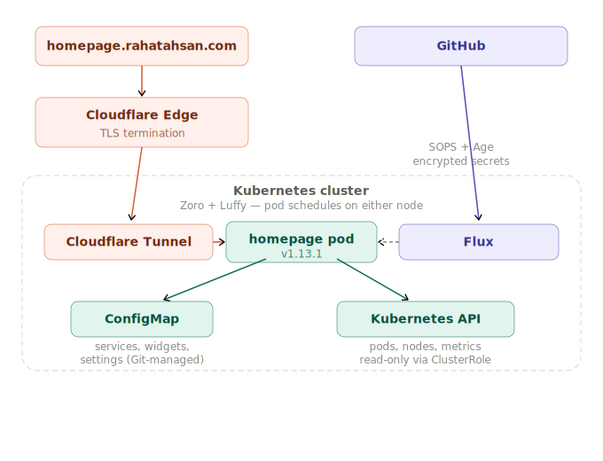

# 🏠 Homepage
Self-hosted dashboard and startpage deployed on Kubernetes via GitOps. [gethomepage/homepage](https://github.com/gethomepage/homepage)

Single pod, ConfigMap-driven config, Kubernetes API integration for live cluster metrics. Zero persistence needed — config lives in Git.

**Live at** [homepage.rahatahsan.com](https://homepage.rahatahsan.com)

> **TL;DR:** Built a cluster dashboard with RBAC-scoped read-only Kubernetes API access, config-as-code via ConfigMap (zero persistence), and a documented, explicit risk acceptance for one PSA gap — with the threat model spelled out.

     

---

## Architecture

<p align="center">
  
</p>

---

## Stack

| Concern | Solution |
|---------|----------|
| Config | Kubernetes ConfigMap — all YAML config lives in Git, no persistence needed |
| External access | Cloudflare Tunnel → [homepage.rahatahsan.com](https://homepage.rahatahsan.com) — no open ports |
| Cluster integration | ClusterRole + ClusterRoleBinding — read-only access to cluster API for live metrics |
| Security | PSA baseline enforced, restricted audited — non-root, capabilities dropped, seccomp |
| Resources | App + cloudflared requests/limits tuned from 30 days of Prometheus data |

---

## 📁 Repo Structure

```
apps/
  base/homepage/          ← deployment, service, serviceaccount, rbac, configmap (shared)
  staging/homepage/       ← namespace only, points to base, no Cloudflare
  production/homepage/    ← namespace with PSA labels, Cloudflare tunnel
clusters/
  staging/                ← Flux entry point, SOPS config
docs/
  homepage/README.md      ← you are here
```

Base defines everything homepage needs to run. Staging stamps the namespace and points at base — no Cloudflare, internal only. Production points at the same base and adds the Cloudflare tunnel. The delta lives entirely in the environment overlay, base is untouched.

---

## 🔒 Security

Security is implemented in layers. Each layer assumes the previous one failed.

### Pod Security Admission — namespace enforced

The `homepage` namespace enforces the `baseline` Pod Security Standard and audits against `restricted`. Homepage cannot meet `restricted` because it writes an internal cache at runtime — `readOnlyRootFilesystem: true` crashes the app. Baseline is enforced to block serious privilege escalations. Restricted is audited for visibility.

```yaml
labels:
  pod-security.kubernetes.io/enforce: baseline
  pod-security.kubernetes.io/warn: restricted
  pod-security.kubernetes.io/audit: restricted
```

### Pod Security Context

```yaml
spec:
  securityContext:
    runAsNonRoot: true
    runAsUser: 1000
    runAsGroup: 1000
    seccompProfile:
      type: RuntimeDefault
  containers:
  - securityContext:
      allowPrivilegeEscalation: false
      readOnlyRootFilesystem: false  # homepage writes internal cache
      capabilities:
        drop:
        - ALL
```

| Setting | What It Does |
|---------|-------------|
| `runAsNonRoot: true` | Kubernetes rejects the pod if the process would run as root |
| `runAsUser: 1000` | Process runs as non-root user |
| `capabilities.drop: ALL` | All Linux kernel capabilities stripped — no raw sockets, no module loading, no ptrace |
| `seccompProfile: RuntimeDefault` | Blocks dangerous kernel syscalls used in container breakout attacks |
| `allowPrivilegeEscalation: false` | Process cannot gain more privileges mid-run — sudo and setuid binaries are blocked |
| `readOnlyRootFilesystem: false` | Intentionally false — see explanation below |

**Why `readOnlyRootFilesystem: false` is acceptable here:**

`readOnlyRootFilesystem: true` is valuable because it prevents an attacker who gains code execution inside the container from writing malicious files to disk — backdoors, modified binaries, credential files. The threat it blocks is persistence and lateral movement after a breach.

Homepage is a Next.js application. At runtime it writes a `.next` build cache to its own container filesystem. This is not user data, not secrets, not config — it is compiled JavaScript that Next.js regenerates on every startup. The write target is the container's ephemeral layer, which is destroyed when the pod is deleted. Nothing written there survives a restart.

This means the actual attack surface added by `false` is narrow:

- An attacker would need to achieve remote code execution inside the homepage process
- The only thing they could write to is the container's ephemeral filesystem
- That filesystem is destroyed on pod restart and contains no secrets, no credentials, and no data worth stealing — all config comes from the read-only ConfigMap mount, and all secrets are never mounted into this pod at all
- They cannot write to the ConfigMap, the cluster API, or any persistent storage — those are all external and controlled by RBAC and Kubernetes admission

The gap is real and noted. It is accepted here because the blast radius of exploitation is limited to the ephemeral container layer of a read-only dashboard with no sensitive data. If homepage ever gains access to secrets or sensitive mounts, this decision should be revisited.

### RBAC

Homepage queries the Kubernetes API to power cluster and node widgets. A dedicated ServiceAccount, ClusterRole, and ClusterRoleBinding are created with read-only permissions — `get` and `list` only, no writes anywhere.

```
Permissions granted:
  namespaces, pods, nodes          → get, list
  ingresses, ingressroutes         → get, list
  httproutes, gateways             → get, list
  metrics.k8s.io nodes/pods        → get, list  ← actual CPU/memory numbers
```

ClusterRole and ClusterRoleBinding are cluster-wide. Don't deploy a second instance with the same name — you'll get a conflict.

---

## 🧠 Key Engineering Decisions

**proxmox.yaml crash on first deploy.** Homepage v1.13.1 added `proxmox.yaml` as a required config file not documented in the upstream installation guide. At startup it tried to copy the skeleton file into `/app/config`, but subPath ConfigMap mounts make the directory non-writable. The copy failed with `EACCES: permission denied`, the pod crashed, and the liveness probe timed out — surfacing as a bad gateway. Diagnosed via `kubectl logs --previous`. Fixed by adding `proxmox.yaml: ""` to the ConfigMap and a matching volumeMount — homepage sees the file already exists and skips the copy.

**Resource limits raised after finding hidden CPU throttling — June 2026.** This was the only one of the three apps with existing `resources` (request 50m/128Mi, limit 200m/256Mi). 30 days of Prometheus data showed **562–3378 CPU-throttled periods** across sampled pod generations, despite tiny average CPU usage (0.0008–0.03 cores) — bursty short-lived spikes (dashboard load fetching from multiple widget sources) were exceeding the 200m limit even though the average looked idle. CFS throttling penalises bursts regardless of average usage. Live memory usage (~152MB) was also already above the old 128Mi request. Raised CPU limit 200m → 500m (sized as "clearly insufficient at 200m, give a substantial multiple" — the actual burst peak wasn't captured directly) and memory request 128Mi → 160Mi; memory limit and CPU request were left unchanged with existing headroom. Applied via `op: replace` since (unlike linkding/audiobookshelf) this deployment already had a `resources` block.

**PSA gap documented, not silently ignored** — see the Security section above: `readOnlyRootFilesystem: false` is required for homepage's Next.js cache, with the threat model spelled out explicitly rather than left as an unexplained exception.

<details>
<summary><strong>Additional implementation notes</strong></summary>

**No persistence needed.** Config lives entirely in Git via ConfigMap. Using a PV for config would create two sources of truth that drift over time. `emptyDir` for logs is intentional and ephemeral.

**Dropped the legacy Secret resource from upstream docs.** The official install docs include a `kubernetes.io/service-account-token` Secret — a pre-1.24 pattern modern clusters auto-create. Including it would create a redundant long-lived token.

**Pinned image instead of `latest`.** Upstream docs use `latest`. In GitOps, `latest` means Flux can't detect drift. Pinned to `v1.13.1`; Renovate handles upgrades automatically.

**Local DNS SERVFAIL during debugging.** `dig homepage.rahatahsan.com` returned SERVFAIL — local DNS was going through Tailscale (`100.100.100.100`) which couldn't resolve public DNS. Use `dig ... @1.1.1.1` to bypass when debugging.

**App discovery is manual, not automatic.** Homepage supports service discovery via Ingress annotations, but this cluster uses Cloudflare Tunnels with no Ingress objects. All apps are listed manually in `services.yaml`.

**cloudflared sidecar** got resources for the first time: requests 10m/32Mi, limit 64Mi memory — same small, stable footprint observed across all three apps' tunnels.

</details>

---

## 🔗 Connecting Apps

Apps are listed manually in `services.yaml` in the ConfigMap. Icons resolve automatically from [walkxcode/dashboard-icons](https://github.com/walkxcode/dashboard-icons) by name.

```yaml
services.yaml: |
  - Media:
      - Audiobookshelf:
          href: https://audiobooks.rahatahsan.com
          icon: audiobookshelf.png
  - Productivity:
      - Linkding:
          href: https://links.rahatahsan.com
          icon: linkding.png
  - Monitoring:
      - Grafana:
          href: https://grs.rahatahsan.com
          description: Local network only
          icon: grafana.png
```

To add a new app — update `services.yaml` in the ConfigMap, commit, push. Homepage hot-reloads config changes from the ConfigMap without a pod restart.

---

## 🚀 What's Next

| Item | Status |
|------|--------|
| Readiness probe tuning | Planned |
| Add new apps as they're deployed | Ongoing |
| Confirm CPU throttling resolved | Watch `container_cpu_cfs_throttled_periods_total` for 30 days post resource bump |

---

## 🔗 Related

- [Homelab Overview](https://github.com/AhsanRahat12/Homelab)
- [GitHub Profile](https://github.com/AhsanRahat12)
