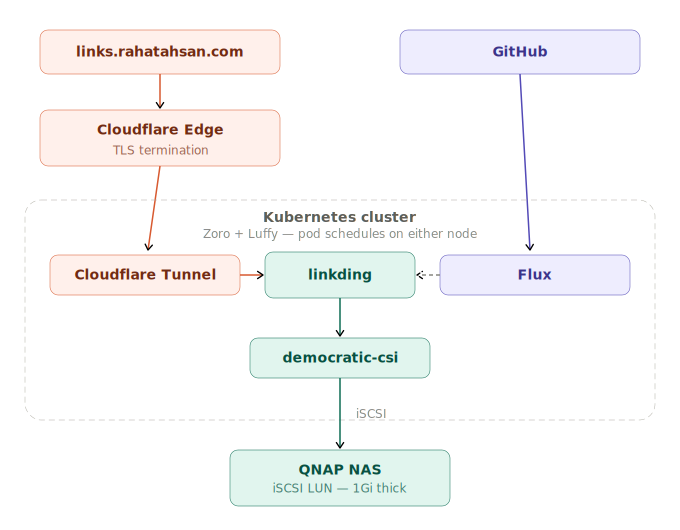

# 🔖 Linkding
Self-hosted bookmark manager deployed on Kubernetes via GitOps. [sissbruecker/linkding](https://github.com/sissbruecker/linkding)

Three-stage storage migration from SD card to fully automated iSCSI failover. No nodeSelector, no single point of failure.

**Live at** [links.rahatahsan.com](https://links.rahatahsan.com)

---

## Architecture

<p align="center">
  
</p>

---

## Stack

| Concern | Solution |
|---------|----------|
| Deployment | Flux GitOps — no manual `kubectl apply` |
| Secrets | SOPS + Age encryption, safe to store in public Git |
| Storage (staging) | local-path PVC — 200Mi, SD card constrained, intentional |
| Storage (production) | democratic-csi → iSCSI LUN on QNAP NAS — 1Gi Thick provisioned, data off the Pi entirely |
| CSI Driver | democratic-csi node-manual — handles iSCSI attach/detach between nodes automatically |
| External access | Cloudflare Tunnel → [links.rahatahsan.com](https://links.rahatahsan.com) — no open ports or port forwarding (production only) |
| Local access | Traefik Ingress + Cloudflare DNS A record pointing to cluster LAN IP — resolves internally, not reachable externally |
| Image updates | Renovate CronJob — automated PRs on new releases |
| Security | PSA restricted enforced, non-root (UID 33), capabilities dropped, seccomp RuntimeDefault, read-only filesystem |
| Deploy strategy | `Recreate` — RWO iSCSI volume requires single-pod exclusive access, RollingUpdate causes deadlock |
| Health checks | Readiness + liveness probes on `/health` port 9090 |

---

## 📁 Repo Structure

```
apps/
  base/linkding/              ← deployment, service, PVC (shared across environments)
  staging/linkding/           ← namespace, encrypted secrets, PVC size patch
  production/linkding/        ← iSCSI PV, Cloudflare tunnel, encrypted secrets
clusters/
  staging/                    ← Flux entry point, SOPS config
infrastructure/
  controllers/
    base/democratic-csi/      ← HelmRelease, StorageClass, CHAP secret
docs/
  linkding/README.md          ← you are here
  migrations/migrate-linkding.yaml
```

Base defines what linkding needs to run. Staging stamps the namespace, reduces PVC size for SD card constraints, and injects environment-specific secrets. Production points at the same base and overrides storage to iSCSI — the delta lives entirely in the environment overlay, base is untouched.

---

## 🔒 Security

Security is implemented in layers. Each layer assumes the previous one failed.

### Pod Security Admission — namespace enforced

The `linkding-prod` namespace enforces the `restricted` Pod Security Standard. Any pod that does not meet the standard is rejected at admission time before it ever runs.

```yaml
labels:
  pod-security.kubernetes.io/enforce: restricted
  pod-security.kubernetes.io/warn: restricted
  pod-security.kubernetes.io/warn-version: latest
```

`warn` is kept alongside `enforce` so future violations surface immediately as warnings.

### Pod Security Context

The initial foundation was `runAsUser: 33`, `runAsGroup: 33`, `fsGroup: 33` (www-data), and `allowPrivilegeEscalation: false`. Implementing PSA restricted surfaced three additional gaps which were added deliberately.

```yaml
spec:
  securityContext:
    runAsNonRoot: true
    runAsUser: 33
    runAsGroup: 33
    fsGroup: 33
    seccompProfile:
      type: RuntimeDefault
  containers:
  - securityContext:
      allowPrivilegeEscalation: false
      readOnlyRootFilesystem: true
      capabilities:
        drop:
        - ALL
```

| Setting | What It Does |
|---------|-------------|
| `runAsNonRoot: true` | Kubernetes rejects the pod if the process would run as root |
| `runAsUser: 33` | Process runs as `www-data`, not root |
| `capabilities.drop: ALL` | All Linux kernel capabilities stripped — no raw sockets, no module loading, no ptrace |
| `seccompProfile: RuntimeDefault` | Blocks dangerous kernel syscalls used in container breakout attacks |
| `allowPrivilegeEscalation: false` | Process cannot gain more privileges mid-run — sudo and setuid binaries are blocked |
| `readOnlyRootFilesystem: true` | Container cannot write to its own filesystem — no persistence for an attacker |

`readOnlyRootFilesystem: true` required mounting an `emptyDir` at `/tmp` — linkding's process manager and web server both write pid files and temporary data there at startup. All application data writes go to the dedicated iSCSI-backed PVC.

---

## 🧠 Problems & Decisions

**Container ran as root.** Applied `runAsUser`, `runAsGroup`, and `fsGroup: 33` (www-data) at the pod level. `fsGroup` was the critical one — without it the mounted volume wasn't writable despite running as the correct user.

**Secrets in Git.** Kubernetes secrets are base64, not encrypted. Chose SOPS + Age for Flux's native integration — Flux decrypts at deploy time, the private key never touches the repo.

**Admin user bootstrapping.** Injected `LD_SUPERUSER_NAME` and `LD_SUPERUSER_PASSWORD` via encrypted secret and `envFrom.secretRef` to eliminate manual `createsuperuser` after every deploy.

**Storage evolution — three stages to get it right.**

The storage architecture for linkding went through three distinct stages, each solving a problem the previous stage introduced:

```
Stage 1 — local-path (SD card)
  Data lives on the Pi's SD card
  SD cards are unreliable under write-heavy SQLite workloads
  No failover — pod and data are on the same node

Stage 2 — Static PV + manual iSCSI mount (node affinity)
  Data moved off the Pi to QNAP NAS via iSCSI LUN
  LUN manually mounted on Zoro via fstab
  Static PV with nodeSelector: zoro
  Problem: pod is now pinned to Zoro
  Zoro goes down → linkding goes down, no recovery possible

Stage 3 — democratic-csi (current)
  Data still on QNAP NAS via iSCSI LUN
  democratic-csi manages the full attach/detach lifecycle
  No nodeSelector — pod runs on either Zoro or Luffy
  Node failure is now survivable — pod reschedules, LUN follows
```

**Why democratic-csi instead of a static PV.** A static PV with a local hostPath mount required a `nodeSelector` pinning the pod to Zoro. If Zoro went down, linkding went down with it — no recovery possible. democratic-csi manages the full iSCSI attach/detach lifecycle, removing the nodeSelector entirely. The pod now runs on whichever node Kubernetes picks. If Zoro fails, democratic-csi detaches the LUN from Zoro and reattaches to Luffy automatically.

**Live data migration.** Scaled staging to 0 to stop writes, ran a migration pod mounting both the old hostPath and new iSCSI PVC simultaneously, copied data with `rsync -av`. Cross-namespace PVC limitation meant PVCs couldn't be mounted directly — used hostPath volumes pointing at the underlying filesystem paths instead.

**Cloudflare tunnel conflict.** One tunnel, two environments trying to claim it. Scaled staging Cloudflare to 0, deployed production pointing at the full cluster DNS (`linkding.linkding-prod.svc.cluster.local:9090`), removed Cloudflare from staging. Staging is now internal only via port-forward.

**Base PVC size.** Reduced to 200Mi — production data lives on QNAP, SD card space is limited. Production patches up to 1Gi via `patch-pvc.yaml`.

**iSCSI volume deadlock during rolling restarts.** Because the PVC is `ReadWriteOnce` on iSCSI, only one pod can hold the volume attachment at a time. During a rolling restart the old crashing pod kept the iSCSI lock — it was in CrashLoopBackOff, meaning Kubernetes kept restarting it before it fully released the attachment. The new pod got stuck in `ContainerCreating` indefinitely waiting for the volume to detach. Force deleting the old pod didn't help — the ReplicaSet immediately spawned a replacement which claimed the lock again. Fix: scale the deployment to zero to fully release the iSCSI attachment, wait for democratic-csi to complete the detach, then scale back to one. This came up twice — once when fixing the security context, once when flipping to enforce.

**Implementing Pod Security Admission.** Started with `warn` mode so Kubernetes would flag problems without breaking anything. Three things were missing: the container still had Linux kernel capabilities it didn't need, `runAsNonRoot` wasn't set even though a non-root user was configured, and no syscall restrictions were in place. Each was added and the pod was tested after each change. Making the filesystem read-only caused a crash — linkding needs to write temporary files at startup and had nowhere to do it. Fixed by giving it a small writable directory in memory via `emptyDir`. Once everything was clean, the namespace was locked down to `enforce` — any pod that doesn't meet the standard is now rejected before it runs.

**Recreate strategy added — June 2026.** RWO iSCSI volume means only one pod can hold the attachment at a time. RollingUpdate tries to bring the new pod up before killing the old one — guaranteed deadlock on every deploy. `strategy: Recreate` added explicitly. Will be revisited when CNPG migration lands and the storage architecture changes.

**Readiness and liveness probes added — June 2026.** Linkding exposes `/health` on port 9090 — confirmed against the live pod, returns `{"version": "1.45.0", "status": "healthy"}`. Startup confirmed at ~7s from timestamped logs. No startupProbe needed. Readiness at 10s, liveness at 40s — readiness always fires first (golden rule). Liveness period kept at 30s to avoid aggressive restarts on a stateful SQLite app. Detection: readiness 30s, liveness 90s worst case.

---

## 🔄 Failover

Pod successfully rescheduled from Zoro to Luffy with data intact. democratic-csi detached the iSCSI LUN from Zoro and reattached to Luffy automatically. No manual intervention required.

```
Before: linkding running on Zoro
Cordon Zoro → delete pod → reschedule
After:  linkding running on Luffy — same data, same URL, zero downtime
```

Staging intentionally kept on local-path — no failover, no democratic-csi. The contrast between staging and production demonstrates the architectural difference clearly.

---

## 🚀 What's Next

| Item | Status |
|------|--------|
| Resource limits | Planned — measure with Prometheus before setting |
| PostgreSQL backend | Replace SQLite with PostgreSQL via CloudNative PG. Enables stateless pods, horizontal scaling, and cleaner failover. Next major architectural change. |

---

## 🔗 Related

- [Homelab Overview](https://github.com/AhsanRahat12/Homelab)
- [GitHub Profile](https://github.com/AhsanRahat12)
